# Git Assignment Documentation

### 1. Repository Initialization and Status Check
```bash
mkdir Git_Assignment1_A00494758
cd Git_Assignment1_A00494758
git init
git status
```

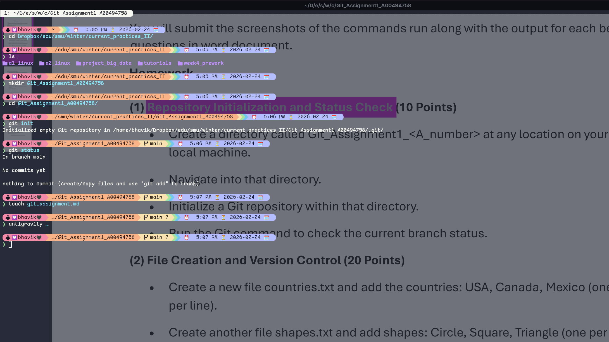

***
### 2. File Creation and Version Control
```bash
touch countries.txt
echo "USA" > countries.txt
echo "Canada" >> countries.txt
echo "Mexico" >> countries.
touch shapes.txt
echo "Circle" >> shapes.txt
echo "Square" >> shapes.txt
echo "Triangle" >> shapes.txt
cat countries.txt shapes.txt
git status
git commit -m "Adding Countries and Shapes"
touch numbers.txt
echo "One" > numbers.txt
echo "Two" >> numbers.txt
echo "Three" >> numbers.txt
git add numbers.txt
git commit -m "Adding numbers"
git log
```

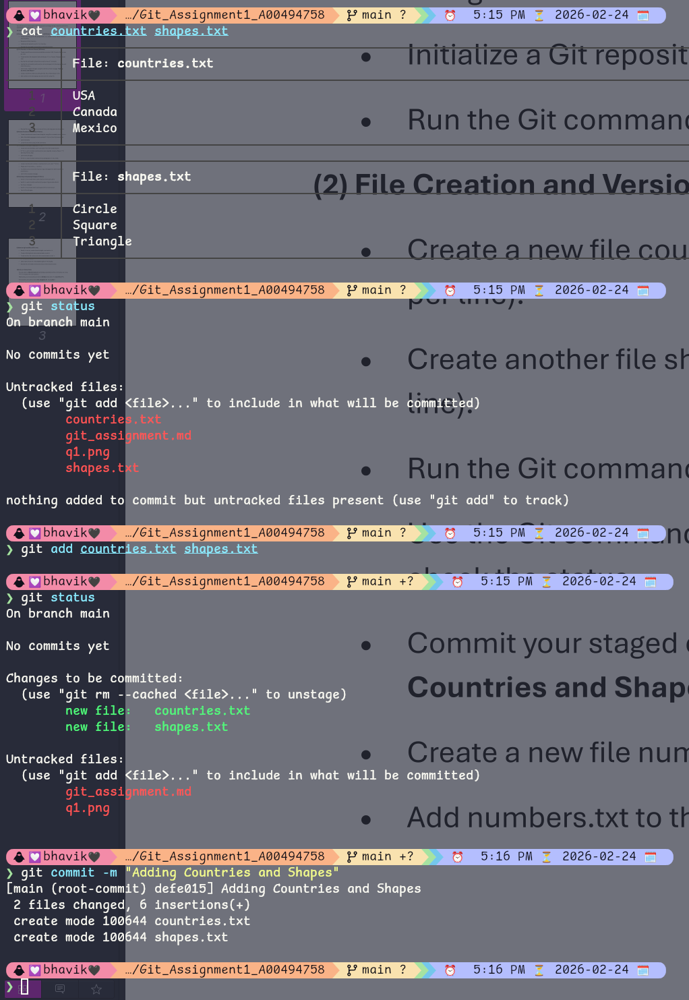


***
### 3. Branch Creation and Commit
```bash
git checkout -b LearnAnalytics
touch languages.txt
echo "R" > languages.txt
echo "Python" >> languages.txt
echo "NumPy" >> languages.txt
git add languages.txt
git commit -m "Add: languages to Learn-Analystics branch"
git log
```

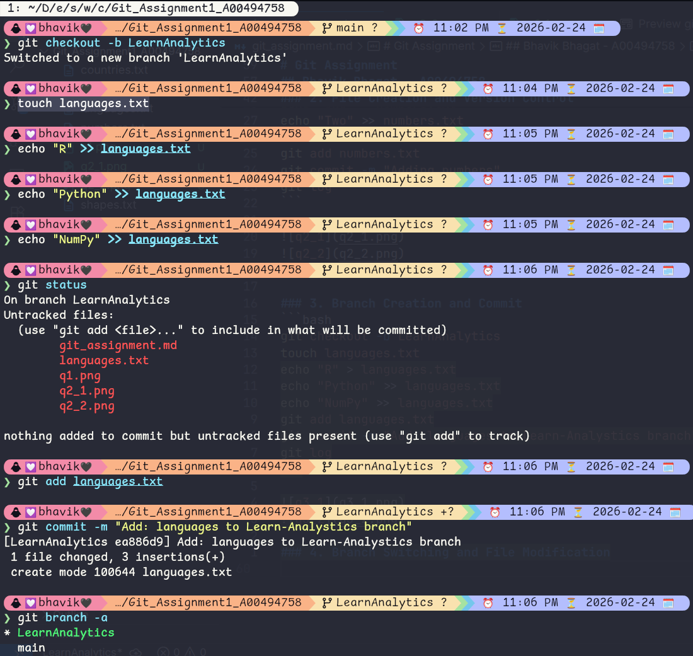

***
### 4. Merging Conflicting Changes
```bash
git checkout -b user1
```

Make changes
```bash
git add countries.txt
git commit -m "change: countries to European Countries"
```
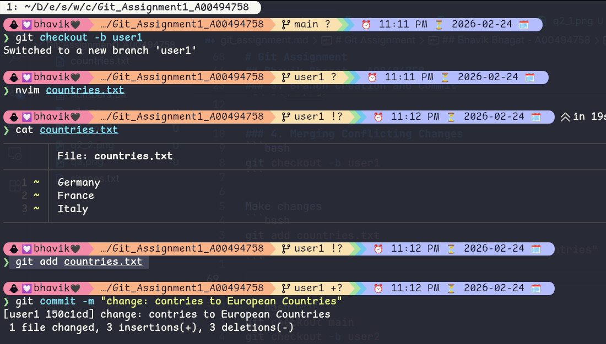

```bash
git checkout main
git checkout -b user2
```

Make changes
```bash
git add countries.txt
git commit -m "change: countries to Asian Countries"
``` 
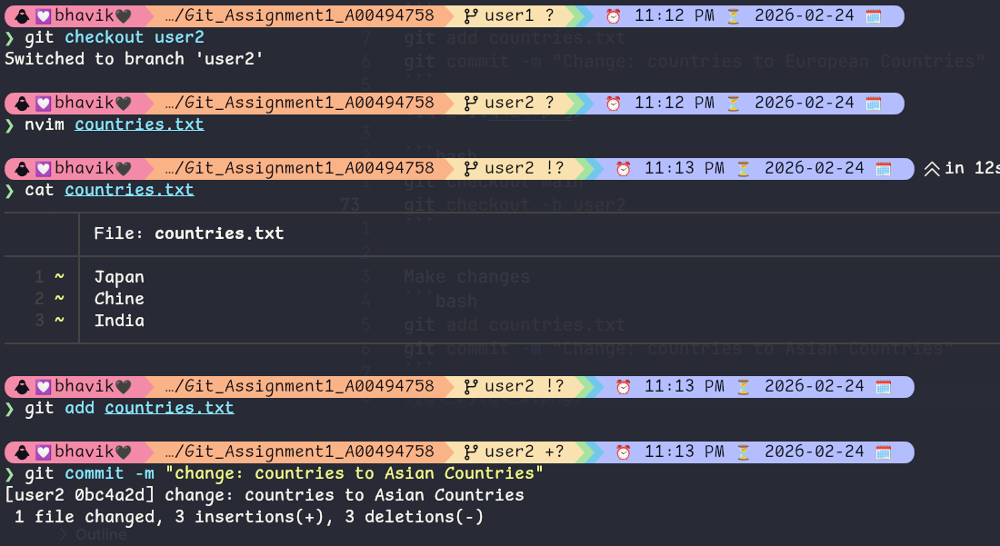


```bash
git checkout -b combine_countries
git merge user1
git add countries.txt
git commit -m "change: resolved merge conflicts by keeping all countries"
```
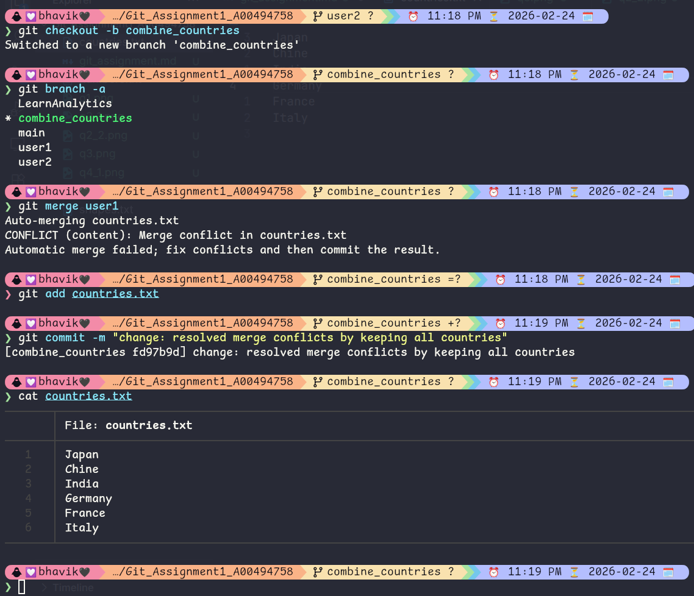

***
### 5. Stashing and Applying Changes
```bash
git checkout main
git checkout -b user3
echo "Australia" >> countries.txt
echo "Brazil" >> countries.txt
```

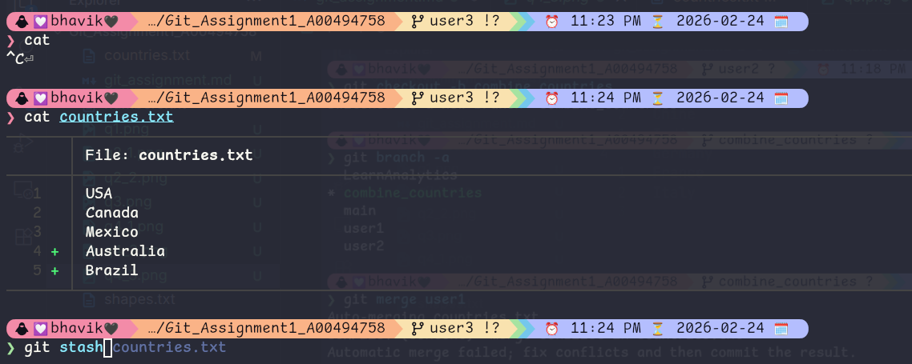


```bash
git stash
git checkout main
echo "UK" >> countries.txt
git add countries.txt
git commit -m "add: UK"
```

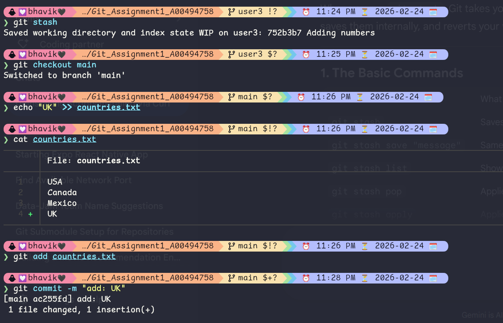

```bash
git checkout user3
git stash pop
git add countries.txt
git commit -m "add: Australia and Brazil"
```
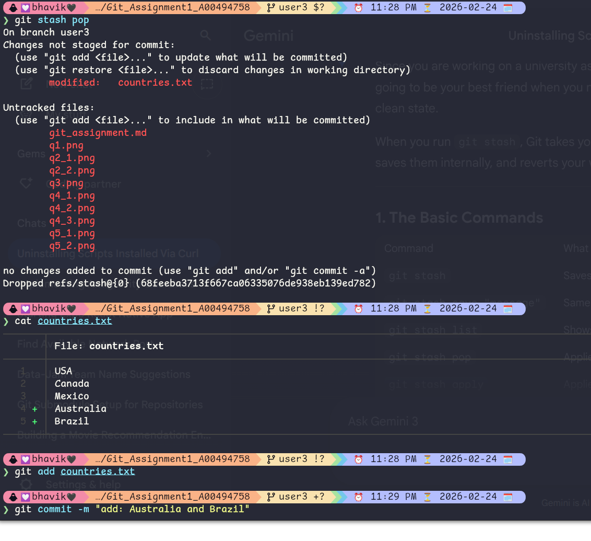

***
### 6. Advanced Git Workflow
```bash
git checkout main
git checkout -b bugfix
touch bugfix.txt
echo "Bugfix" >> bugfix.txt
git add bugfix.txt
git commit -m "add: bugfix"
touch random.txt
echo "Random" >> random.txt
git add random.txt
git commit -m "add: random"
```

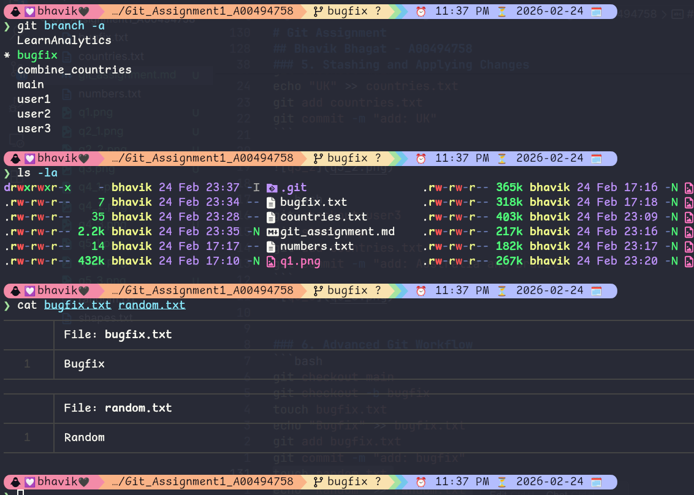

```bash
git checkout main
git reflog
git cherry-pick 39ab44f
ls -la
```

In this case, cherry-pick took the bugfix.txt file from the bugfix branch and added it to the main branch.


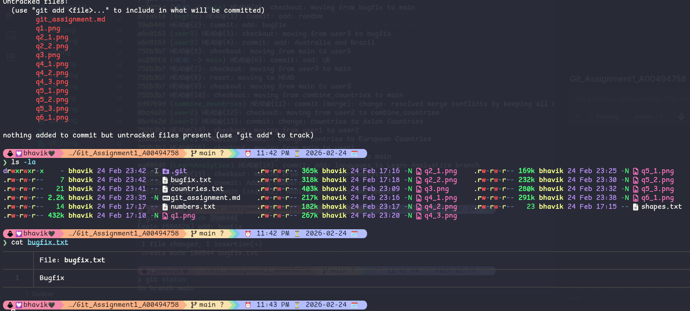
***